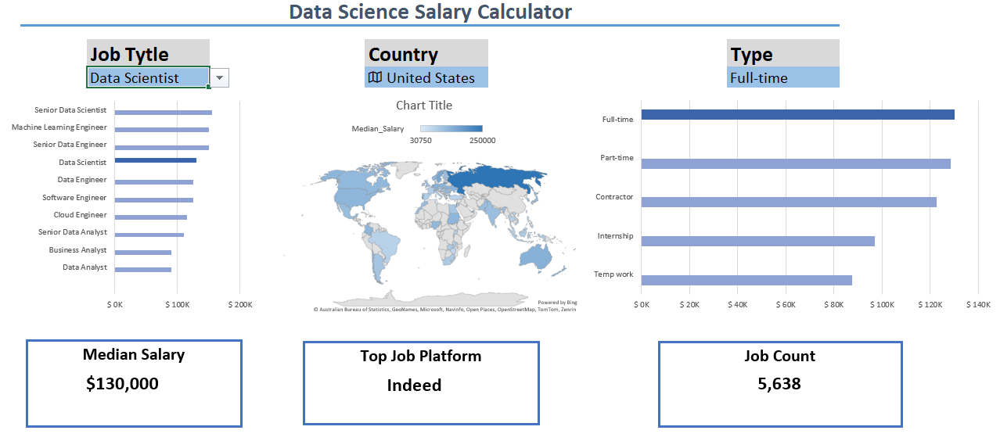
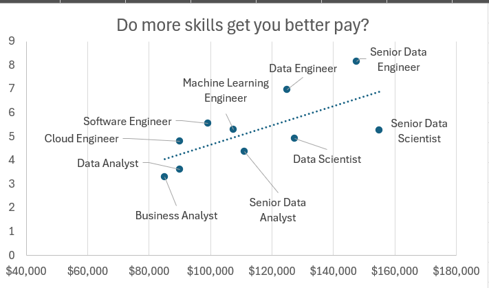

# Excel-Projects-Data-Analysis
Data analytics portfolio featuring end-to-end projects built with Power Query, Power Pivot (DAX), and interactive Excel dashboards.
Explore my end-to-end data projects where I transform raw datasets into meaningful business insights using advanced Excel.

## Global Salary Dashboard
This project visualizes the landscape of data science compensation. It allows users to filter through various roles and experience levels to identify high-paying opportunities.
[Checkout my work here](Project1_Salary-Dashboard.xlsx)

## Salary & Skills Market Analysis
A deep-dive analysis focused on the correlation between specific technical skills and salary growth. This project utilizes complex data modeling to highlight the most valued assets in the current market.
[Checkout my work here](Project2_Salary-Analysis.xlsx)

---
### ⚙️ Professional Toolkit:
* **ETL:** Power Query for data cleaning and preparation.
* **Modeling:** Power Pivot with advanced DAX measures.
* **Visualization:** Interactive Dashboards and Pivot Charts.
